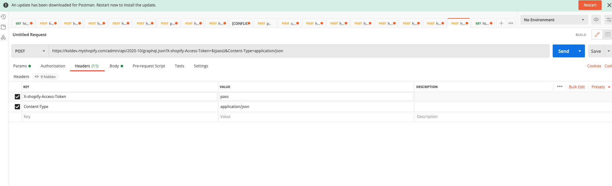

Shopify でずっと RESTAPI を使用していたけど、これから GraphQL に移行する人向けの記事です。
とりあえず、店の名前と商品を取得するところまでやるハンズオン形式の記事です。

# shopify で private_app を作成

shopify 公式[https://help.shopify.com/ja/manual/apps/private-apps]
これを参考に private_app を作成します。
欲しいのは api のパスワードです。
これをメモしておきましょう。

# postman をインストール

postman[https://www.postman.com/]
postman
ガチ便利です。
どんな api があるのか調べる段階の時に使用するイメージです。
環境構築せず、すぐに api を叩くことができます。

# postman 少し設定

- postman の http メソッドを POST に変更
- url にリクエスト先を記述

```
https:${お店の名前}//.myshopify.com/admin/api/2020-10/graphql.json
```

を url に記述

- Headers に諸々追加

```
key: X-shopify-Access-Token value: "一番最初に取得したapipassを記述。shppaとかで始まる気がする"
key: Content-Type           value: application/json
```

- body の type を GraphQL に変更

最終的にはこうなる。

_postman の画面_
:::message
${pass}には private_app の pass が入ります
:::

# ストアの名前を取得する

お店の名前を取得してみます。
QUERY に

```
query {
    shop {
        name
    }
}
```

と記述します。
send ボタンを押すと、、

```
{
    "data": {
        "shop": {
            "name": "orenomise"
        }
    },
    "extensions": {
        "cost": {
            "requestedQueryCost": 1,
            "actualQueryCost": 1,
            "throttleStatus": {
                "maximumAvailable": 1000.0,
                "currentlyAvailable": 999,
                "restoreRate": 50.0
            }
        }
    }
}
```

お店の名前が送ったリクエストと全く同じ構成で返されます。
GraphQL はこのようにリクエストに書いてある内容でどんなレスポンスが返ってくるかわかるから便利ですよね。

次回は、商品一覧を取得してみようと思います！
